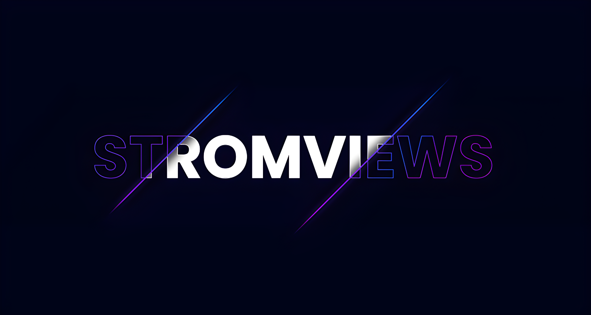

# FREE INSTAGRAM REELS VIEWS - WITH TERMUX
<div align="center">
  
  <br>
  <br>
  <p>
    
    
    
    
    
    
  </p>
  <h4> Get Views On Instagram Reels Using Termux Only ! </h4>
</div>

##

### What is StromViews?
[**StromViews**](https://github.com/RozhakXD/StromViews) is a tool that can be used to get lots of views on your Instagram video reels.

You can get 200++ views, in one hour!

### Termux command?
First you must have the [Termux](https://f-droid.org/repo/com.termux_118.apk) application to run this script and for how to use it can be seen on [**Youtube**](https://youtu.be/6_TEoY4AZVw). Then you enter some basic commands below!
```
$ apt update -y && apt upgrade -y
$ pkg install git python-pip
$ git clone https://github.com/RozhakXD/StromViews
$ cd "StromViews"
$ python -m pip install -r requirements.txt
$ python Run.py
```

```
$ cd "$HOME/StromViews" && git pul
$ python Run.py
```

### Which link can be used?
- The correct and supported link is https://www.instagram.com/p/C08X1bNvh7g/!
- You can change the link **"https://www.instagram.com/reels/C08X1bNvh7g/"** to **"https://www.instagram.com/p/C08X1bNvh7g/"**!
- I suggest getting the video reels link via the Instagram application.

### Why login failed?
- Please change your Instagram account password then log in again.
- Use airplane mode before logging in to this tool!
- Maybe your account has been checkpointed or disabled.
- Please change to another Instagram account.
- Please remember that not all accounts can be used to log in!

### I lost my Instagram account?
- This service depends on the website so it is definitely from the website that uses your account!
- You may not use the main account or the account that will be given views!
- We recommend using a fake account or a new account to log in.

### Why are views not arriving?
- Maybe your post link is wrong or your Instagram account is private!
- The website server is having problems or there are no active users on this website.

### Error in the tools?
- The website is under maintenance or in an inactive state.
- Maybe you entered something wrong that is not what you were told to do.
- The stability of your network also affects how to run this tool.

### Submitting your next view?
You can get 200 views within 1 hour, if you have credit within 1 hour you will get more views, but this time is just an estimate, it could be less or more!

##
```python
print("Good luck hope it works!")
```
##
